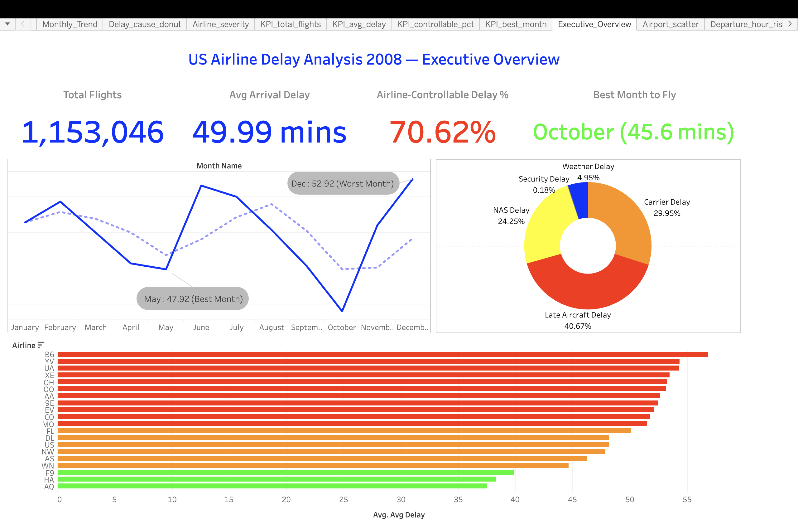
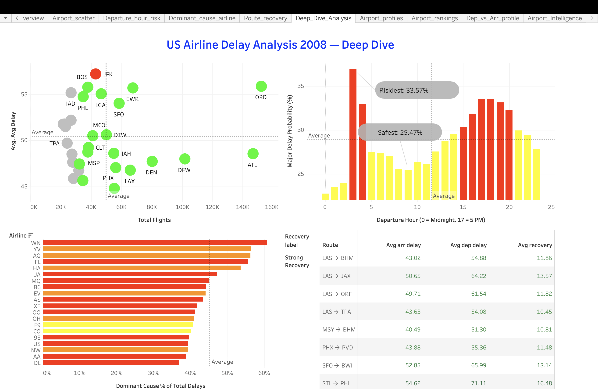
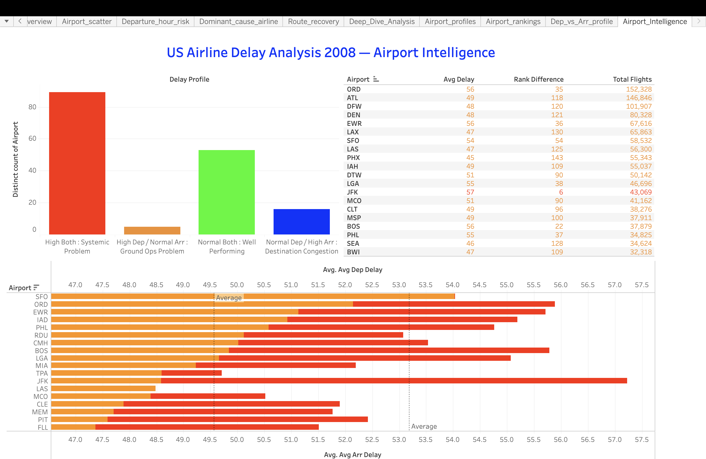

# US Airline Delay Analysis — 2008

A multi-layer end-to-end data analysis project examining **1.15 million US domestic flights** to uncover the root causes of airline delays, identify systemic patterns, and surface actionable insights for airline operations.

**Live Dashboards →** [View on Tableau Public](https://public.tableau.com/app/profile/pratham.kumar5320/viz/US_Airline_Delay_Analysis_2008/Executive_Overview)

---

## Key Findings at a Glance

| Metric | Value |
|--------|-------|
| Total Flights Analysed | 1,153,046 |
| Average Arrival Delay | 49.99 mins |
| Airline-Controllable Delay % | **70.62%** |
| Best Month to Fly | **October** (45.6 mins avg) |
| Worst Month to Fly | **December** (52.92 mins avg) |
| Most Delayed Airline | B6 — JetBlue (~57 mins avg) |
| Most Punctual Airline | AQ — Aloha Air (~37.5 mins avg) |
| Structurally Problematic Airport | **JFK** |
| Best Time to Fly | **5–8 AM** (before cascading delays build) |

---

## Project Architecture

This project follows a **4-layer analytical pipeline**, with each layer building on the last:

```
Raw Data (7M+ rows)
     │
     ▼
┌─────────────┐
│   Python    │  Data Cleaning + EDA
│  (Jupyter)  │  → filtered_airlines_dataset.csv
└─────────────┘
     │
     ▼
┌─────────────┐
│ PostgreSQL  │  12 Deep-Dive SQL Queries
│    (SQL)    │  → 12 aggregated CSV exports
└─────────────┘
     │
     ▼
┌─────────────┐
│    Excel    │  Business Reporting Layer
│  (6 sheets) │  → KPI Dashboard + Pivot Analysis
└─────────────┘
     │
     ▼
┌─────────────┐
│   Tableau   │  Interactive Visual Dashboards
│ (3 dashbds) │  → Executive | Deep Dive | Airport
└─────────────┘
```

---

## Tech Stack

| Layer | Tools Used |
|-------|-----------|
| Data Cleaning & EDA | Python, Pandas, NumPy, Matplotlib, Seaborn |
| Deep Analysis | PostgreSQL, SQL (Window Functions, CTEs, Aggregations) |
| Business Reporting | Microsoft Excel (Pivot Tables, SUMIFS, VLOOKUP, INDEX-MATCH) |
| Visualisation | Tableau Public |

---

## Repository Structure

```
Analyzing-Airline-Delays/
│
├── README.md
│
├── python/
│   └── Analyzing_Airlines_delays.ipynb     # Data cleaning + full EDA
│
├── sql/
│   └── Analyzing_Airline_delays_2008.sql   # 12 analytical SQL queries
│
├── excel/
│   └── Airline_Delays_Analysis.xlsx        # 6-sheet analysis + KPI dashboard
│
├── tableau/
│   └── Analyzing_Airline_delays.twb        # Tableau workbook (live on Tableau Public)
│
└── assets/
    ├── executive_overview.png
    ├── deep_dive.png
    └── airport_intelligence.png
```

---

## Layer 1 — Python: Data Cleaning & EDA

**File:** `python/Analyzing_Airlines_delays.ipynb`

### What was done:
- Loaded and inspected the raw 2008 US Airline dataset (7M+ rows)
- Handled missing values, data type corrections, and outlier treatment
- Removed cancelled/diverted flights for clean delay analysis
- Exported filtered dataset for SQL ingestion

### EDA Visualisations Included:
- Average Arrival & Departure Delay by Airline (ranked bar charts)
- Average Delays by Departure Hour (dual-line time chart)
- Delay Contribution by Cause (pie chart)
- Correlation Heatmap Between All Delay Types

### Key EDA Insight:
The **0.87 correlation between departure and arrival delay** confirms airlines cannot recover lost time in the air — prevention at the gate is the only solution.

---

## Layer 2 — SQL: Deep-Dive Analysis

**File:** `sql/Analyzing_Airline_delays_2008.sql`

12 analytical queries covering:

| Query | Analysis |
|-------|----------|
| q1 | Consistent Routes (low variance performers) |
| q2 | Route Symmetry (outbound vs return delay difference) |
| q3 | Route Delay Recovery (departure vs arrival delta) |
| q4 | Airline Consistency Score (std deviation ranking) |
| q5 | Airline Momentum Trend (month-over-month change) |
| q6 | Airline Severity Profile (mild/moderate/severe breakdown) |
| q7 | Airport Volume vs Delay (busiest airports ranked) |
| q8 | Airport Departure vs Arrival Profile |
| q9 | Departure Hour Risk Score |
| q10 | Monthly Rolling Trend (3-month moving average) |
| q11 | Delay Cause Totals by Airline |
| q12 | Dominant Delay Cause by Airline |

### SQL Techniques Used:
- Window Functions (`ROW_NUMBER`, `RANK`, `LAG`, rolling averages)
- CTEs (Common Table Expressions) for multi-step logic
- Aggregations with `GROUP BY`, `HAVING`, `CASE WHEN`
- Joins across multiple derived tables

---

## Layer 3 — Excel: Business Reporting

**File:** `excel/Airline_Delays_Analysis.xlsx`

6-sheet analysis workbook built for non-technical stakeholders:

| Sheet | Content |
|-------|---------|
| KPI Summary | 4 headline KPIs with conditional formatting |
| Monthly Trend | Month-by-month delay trend with best/worst callouts |
| Delay Cause Analysis | Cause breakdown with % contribution |
| Airline Performance | Full airline ranking table |
| Route Analysis | Top consistent and recovery routes |
| Airport Profiles | Volume vs delay positioning for 163 airports |

### Excel Features Used:
- Pivot Tables for dynamic aggregation
- `SUMIFS`, `AVERAGEIFS`, `COUNTIFS` for conditional calculations
- `VLOOKUP` and `INDEX-MATCH` for cross-sheet lookups
- Conditional formatting for performance tiers (Red/Amber/Green)
- Multi-series charts with helper tables

---

## Layer 4 — Tableau: Interactive Dashboards

**Live Link:** [US_Airline_Delay_Analysis_2008](https://public.tableau.com/app/profile/pratham.kumar5320/viz/US_Airline_Delay_Analysis_2008/Executive_Overview)

### Dashboard 1 — Executive Overview


A C-suite summary view showing headline KPIs, monthly delay trend, delay cause composition, and airline performance rankings at a glance.

---

### Dashboard 2 — Deep Dive Analysis


Operational-level analysis covering departure hour risk patterns, dominant delay cause by airline, and route delay recovery performance.

---

### Dashboard 3 — Airport Intelligence


Airport-level analysis showing the volume vs delay relationship across 163 airports, debunking the assumption that busier airports are always worse performers.

---

## Top 5 Insights from This Project

1. **70.62% of delays are airline-controllable** — this is not a weather or infrastructure crisis, it's an operational one.

2. **Flying at 3–4 AM has paradoxically the highest delays** (~57 mins) due to cascading network disruptions carried over from the previous day. The safest window is **5–8 AM**.

3. **Late Aircraft Delay (40.3%) is the dominant cause** — a single delayed inbound flight triggers a chain of downstream delays across the network.

4. **Busier airports are NOT necessarily worse** — the scatter analysis reveals that high-volume airports like ATL and DFW maintain average performance, while mid-size airports like JFK structurally underperform.

5. **The 0.87 correlation between departure and arrival delay** confirms airlines cannot recover lost time in flight — operational fixes must happen at the gate, not in the air.

---

## How to Reproduce This Project

### Python
```bash
# Clone the repo
git clone https://github.com/prathamkumarr/Analyzing-Airline-Delays

# Install dependencies
pip install pandas numpy matplotlib seaborn jupyter

# Launch notebook
jupyter notebook python/Analyzing_Airlines_delays.ipynb
```

### SQL
```sql
-- Run in PostgreSQL
-- Load filtered dataset first, then execute:
\i sql/Analyzing_Airline_delays_2008.sql
```

### Dataset
The original dataset is the **2008 Airline On-Time Performance** dataset from the US Bureau of Transportation Statistics. Due to file size, it is not included in this repo. Download from [BTS Website](https://www.transtats.bts.gov/DL_SelectFields.aspx).

---

## 👤 Author

**Pratham Kumar**
GitHub: [prathamkumarr](https://github.com/prathamkumarr)
Tableau Public: [pratham.kumar5320](https://public.tableau.com/app/profile/pratham.kumar5320)

---

